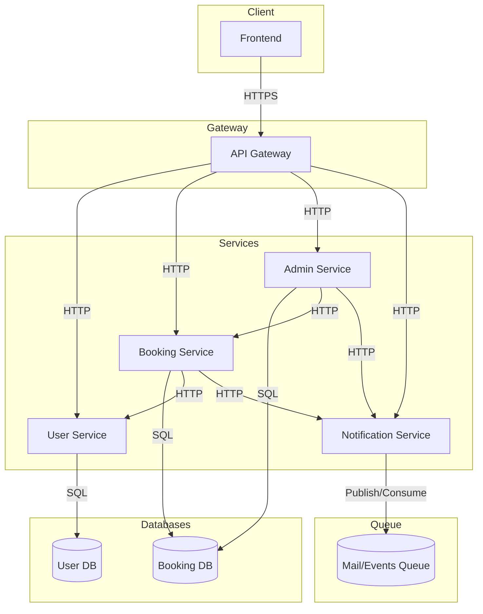
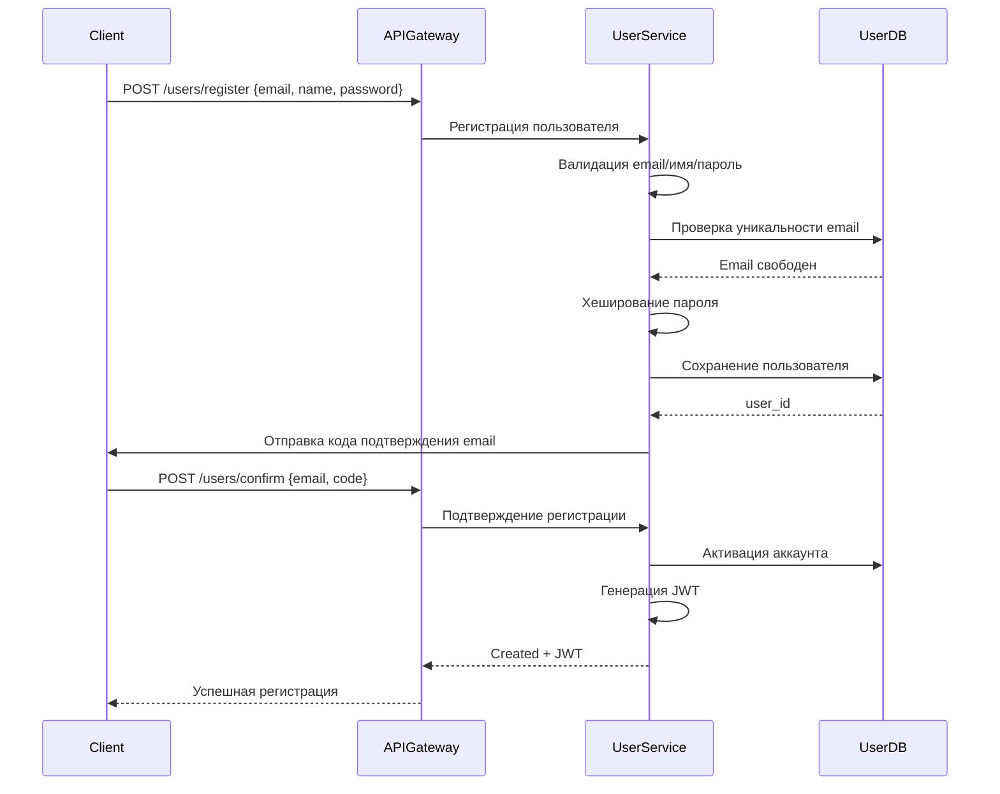
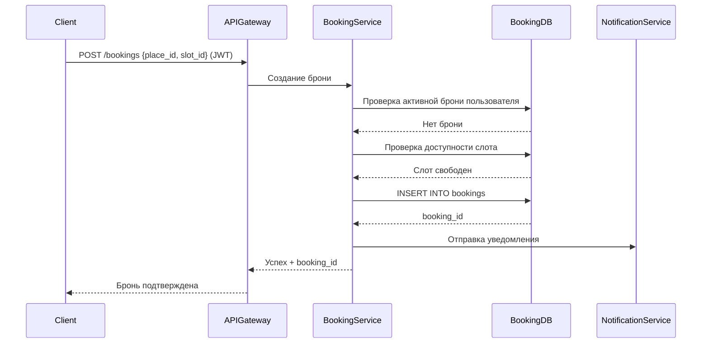
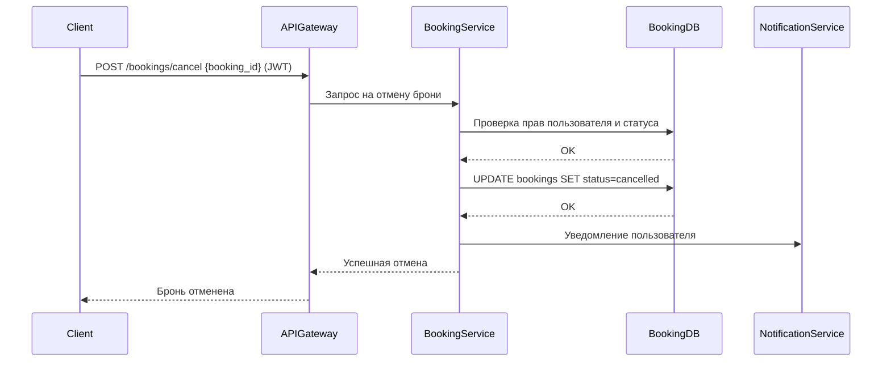
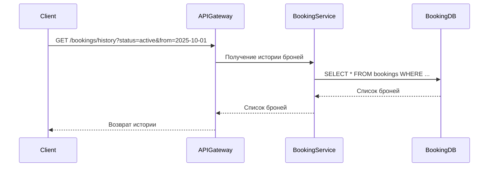
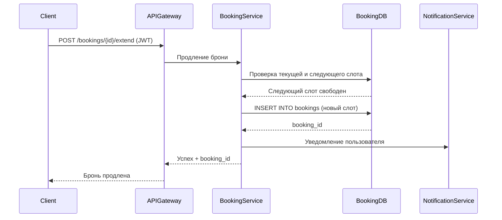
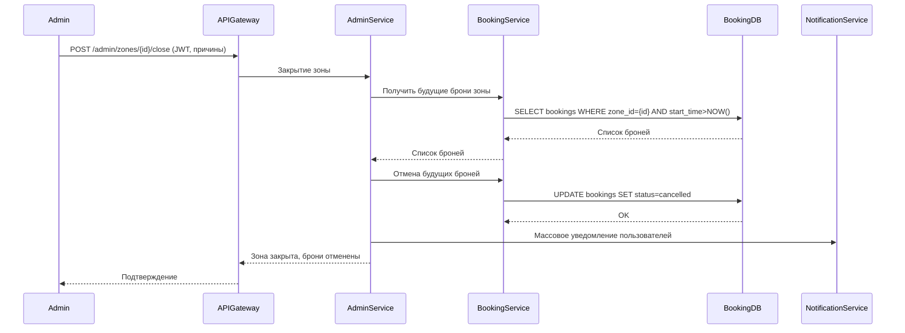

# Техническое решение проекта «Распределённая система бронирования мест в коворкингах кампуса»

## Введение

**Цель проекта**

Разработка распределённой системы онлайн‑бронирования рабочих мест в коворкингах кампуса, где пользователи могут регистрироваться, просматривать зоны и рабочие места с доступными временными слотами, оформлять и отменять бронирования и взаимодействовать с платформой через веб-интерфейс.

**Задачи**

1. Разработать систему регистрации и аутентификации пользователей.
2. Реализовать функционал просмотра зон и рабочих мест с отображением доступных слотов по дате и времени.
3. Создать функционал бронирования: оформление брони, отмена, продление и просмотр истории, гарантируя отсутствие двойных бронирований.
4. Построить отказоустойчивую и масштабируемую архитектуру (горизонтальное масштабирование сервисов, репликация БД) для обеспечения высокой доступности.
5. Обеспечить приемлемую производительность системы и надёжность: транзакционность операций, тестирование и CI/CD.

**Основания для разработки**
Желание участников команды получить опыт в разработке распределённой системы
Учебный проект по курсу "Распределённые системы"

| Участник | Роль |
|-------------|-------------|
| Шитов Иван | Team Lead, Fullstack-разработчик |
| Осипов Илья |  Fullstack-разработчик |
| Роман |  Fullstack-разработчик |
| Роман |  Fullstack-разработчик |

## Глоссарий

| Термин        | Описание |
|---------------|----------|
| Пользователь  | Зарегистрированный клиент системы бронирования |
| Зона          | Локация коворкинга, объединяющая рабочие места (например, конкретное общежитие) |
| Рабочее место | Физическое место, доступное для бронирования |
| Бронь         | Операция резервирования рабочего места на определённый слот времени |
| Слот времени  | Часовой интервал для бронирования (например, 10:00–11:00) |
| История бронирования | Список всех активных и завершённых броней пользователя |
| API Gateway   | Входная точка для всех клиентских запросов |
| User Service  | Сервис управления пользователями и аутентификацией |
| Booking Service | Сервис обработки логики бронирования, отмены, истории |
| Admin Service | Сервис для управления зонами, рабочими местами, проведения обслуживания и рассылки массовых уведомлений | 
| Notification Service | Сервис для отправки email, push и внутренних уведомлений пользователям системы |
| Safety | Свойство системы: невозможность двойного бронирования одного места в один и тот же интервал, атомарность брони/отмены; достигается транзакциями и ограничениями БД |
| Liveness | Свойство системы: запросы на бронирование/отмену обрабатываются в конечном счёте; сервис выдерживает отказы отдельных инстансов (health-check, failover БД) |
| Concurrency | Поддержка конкурентных запросов на одно и то же место/слот; предотвращение гонок за счёт транзакций, блокировок и ограничений БД |
| Eventual Consistency | Допустимое расхождение при чтении с реплик/кэша (UI-списки, heatmap) при строгой консистентности операций записи (бронирование/отмена) через primary БД |

## Функциональные требования

### Для User Service:

1. Регистрация пользователя. `POST /users/register {name, email, password}` → `{token}` (JWT в httpOnly cookie) или подтверждение регистрации; проверка уникальности логина/email.
2. Аутентификация. `POST /users/login {email, password}` → `{token}`; блокировка после 5 неудачных попыток (brute-force).
3. Восстановление пароля. `POST /users/recover {email}` → письмо/код; смена пароля `POST /users/recover/confirm {email, code, new_password}`.

### Для Booking Service:

4. Просмотр зон. `GET /zones` → список зон (статус: open/maintenance).
5. Просмотр мест зоны. `GET /zones/{zone_id}/places` → список мест с кратким статусом.
6. Просмотр слотов места. `GET /places/{place_id}/slots?date=YYYY-MM-DD` → слоты со статусом свободно/занято.
7. Создание брони. `POST /bookings {place_id, slot_id}` → `{booking_id, status:"active"}`; при конфликте → `409`.
8. Отмена брони. `POST /bookings/cancel {booking_id}` → `{status:"cancelled"}`; проверка прав владельца.
9. История бронирований. `GET /bookings/history?limit=<n>&offset=<m>&status=<s>&from=<date>&to=<date>` → список; экспорт: `GET /bookings/history?export=csv|xlsx`.
10. Продление брони. `POST /bookings/{id}/extend` → новая бронь на следующий слот при доступности.

### Для Admin Service:

11. CRUD зон. `POST/PUT/DELETE /admin/zones {name, status}`.
12. CRUD мест. `POST/PUT/DELETE /admin/places {zone_id, name, status}`.
13. Закрытие зоны на обслуживание. `POST /admin/zones/{id}/close {reason, from, to}` → массовая отмена будущих броней.
14. Управление менеджерами. `POST/DELETE /admin/managers {user_id, zone_ids}` (назначение/снятие ролей).
15. Массовые уведомления. `POST /admin/notifications {audience, title, body}` → рассылка пользователям.

### Для Notification Service:

16. Отправка уведомлений (асинхронно). `POST /notifications {user_id|audience, type, payload}`; обработка через очередь, статусы доставки `GET /notifications/{id}`.

### Для Frontend (Next.js):

17. Регистрация и вход. `POST /users/register {name,email,password}`, `POST /users/login {email,password}` → JWT в httpOnly cookie; редирект на основной экран.
18. Просмотр зон. `GET /zones` → список зон с индикаторами доступности.
19. Просмотр мест зоны. `GET /zones/{zone_id}/places` → отображение мест и статусов.
20. Просмотр слотов места. `GET /places/{place_id}/slots?date=YYYY-MM-DD` → слоты; обновление polling’ом каждые 30–60 сек.
21. Создание брони. `POST /bookings {place_id, slot_id}` → `{booking_id, status}`; обновление списка слотов и “Мои бронирования”.
22. Отмена брони. `POST /bookings/cancel {booking_id}` → `{status:"cancelled"}`; слот становится доступен.
23. История бронирований. `GET /bookings/history?...` → список с пагинацией; экспорт CSV/Excel.
24. Продление брони. `POST /bookings/{id}/extend` → обновление карточки брони и слотов.
25. Админ‑операции. `POST/PUT/DELETE /admin/zones|places`, `POST /admin/zones/{id}/close`, `POST /admin/notifications` → подтверждения действий в UI.

## Ограничения и особенности предметной области

- Бронирование возможно только для зарегистрированных пользователей
- Бронирование строго по слотам (шаг — 1 час)
- Каждый пользователь может иметь одновременно не более одной активной брони на слот
- Сервис должен быть доступен круглосуточно
- Масштабируемость: система легко расширяется на новые зоны/общежития

---

## Нефункциональные требования

| Требование         | Значение                                              |
|--------------------|------------------------------------------------------|
| Доступность        | ≥ 99.9%                                              |
| Время отклика      | ≤ 200 мс при 100 одновременных пользователях         |
| Отказоустойчивость | Работа при сбое любого одного узла                   |
| Масштабируемость   | Горизонтальная, поддержка добавления новых зон       |
| Консистентность    | Строгая: невозможны двойные/потерянные брони         |
| Безопасность       | Пароли в хешированном виде |
| Тестируемость      | 80% бизнес-логики покрыто юнит-тестами               |

---

##  Пользовательские сценарии

### Сценарий: регистрация нового пользователя
1. Пользователь вводит email, ФИО и пароль в форме регистрации.
2. Система отправляет код подтверждения на email.
3. Пользователь вводит код подтверждения.
4. Система создаёт аккаунт и авторизует пользователя (JWT).
5. Пользователь попадает в личный кабинет.

### Сценарий: вход в систему
1. Пользователь открывает форму входа и вводит email и пароль.
2. Система проверяет учётные данные.
3. При успехе система выдаёт сессию/JWT.
4. Пользователь перенаправляется на главную страницу.

### Сценарий: просмотр зон и рабочих мест
1. Пользователь открывает раздел «Зоны».
2. Система показывает список доступных зон с индикаторами занятости.
3. Пользователь выбирает зону.
4. Система отображает список рабочих мест выбранной зоны.

### Сценарий: просмотр доступности слотов
1. Пользователь открывает страницу конкретного рабочего места.
2. Выбирает дату (календарь).
3. Система показывает часовые слоты со статусом «свободно/занято».
4. Пользователь при необходимости применяет фильтр по времени.

### Сценарий: бронирование места
1. Пользователь выбирает свободный слот.
2. Нажимает «Забронировать».
3. Система проверяет доступность и отсутствие конфликтующей брони пользователя.
4. Система создаёт бронь и показывает подтверждение.
5. Бронь появляется в разделе «Мои бронирования».

### Сценарий: отмена бронирования
1. Пользователь открывает «Мои бронирования».
2. Выбирает активную бронь и нажимает «Отменить».
3. Система проверяет права и статус.
4. Система меняет статус на «отменена» и освобождает слот.
5. Пользователь видит обновлённый список броней.

### Сценарий: просмотр истории бронирований
1. Пользователь открывает «История бронирований».
2. Система отображает завершённые и отменённые брони.
3. Пользователь при необходимости применяет фильтры (дата, зона, статус).
4. Система обновляет список по выбранным критериям.

### Сценарий: продление бронирования
1. Пользователь открывает карточку активной брони.
2. Нажимает «Продлить» на следующий час.
3. Система проверяет доступность следующего слота.
4. При успехе создаётся новая бронь и отображается подтверждение.

##  Архитектура системы

### Компоненты

- **API Gateway (FastAPI)**
  - Маршрутизирует все клиентские запросы
  - Выполняет базовую аутентификацию

- **User Service (FastAPI)**
  - Управляет регистрацией, аутентификацией, хранит пользователей
  - Таблица: `users` (id, name, hashed_password, created_at)

- **Admin Service (FastAPI)**
    - Управление зонами, местами, обслуживание, уведомления.

- **Booking Service (FastAPI)**
  - Обрабатывает логику бронирования, отмены, история
  - Таблицы: `zones`, `places`, `slots`, `bookings`
    - `zones` (id, name, address, places_count)
    - `places` (id, zone_id, name)
    - `slots` (id, place_id, start_time, end_time)
    - `bookings` (id, user_id, slot_id, status: active/cancelled, created_at)

- **Notification Service (опционально, FastAPI)**
  - Отправляет email/push-уведомления о подтверждении/отмене брони

- **PostgreSQL**
  - Хранит все данные системы, отдельные схемы для пользователей и бронирований

- **Frontend (Next.js/React, вне текущей архитектуры, взаимодействует через API Gateway)**

## Технические сценарии

### Сценарий: регистрация нового пользователя

1. Клиент отправляет в API Gateway запрос POST /users/register с email, ФИО и паролем
2. API Gateway перенаправляет запрос в User Service
3. User Service валидирует email, проверяет уникальность
4. User Service хеширует пароль и сохраняет пользователя в User DB
5. User Service отправляет код подтверждения на email пользователя
6. Пользователь вводит код подтверждения, система активирует аккаунт
7. User Service генерирует JWT токен
8. API Gateway возвращает токен клиенту

---

### Сценарий: создание брони рабочего места

1. Клиент отправляет POST /bookings с JWT токеном, id места и слота
2. API Gateway валидирует токен и перенаправляет запрос в Booking Service
3. Booking Service проверяет наличие активной брони пользователя на этот слот
4. Booking Service проверяет доступность слота (нет других броней)
5. При успехе Booking Service сохраняет запись о бронировании в Booking DB
6. Booking Service отправляет уведомление пользователю через Notification Service
7. API Gateway возвращает подтверждение и booking_id клиенту

---

### Сценарий: отмена бронирования

1. Клиент отправляет POST /bookings/cancel с JWT токеном и booking_id
2. API Gateway валидирует токен и перенаправляет запрос в Booking Service
3. Booking Service проверяет права пользователя и статус брони
4. Booking Service обновляет статус бронирования в базе данных
5. Booking Service отправляет уведомление пользователю через Notification Service
6. API Gateway возвращает подтверждение отмены

---

### Сценарий: просмотр истории бронирований

1. Клиент отправляет GET /bookings/history с JWT токеном и фильтрами
2. API Gateway валидирует токен и перенаправляет запрос в Booking Service
3. Booking Service формирует SQL-запрос с фильтрами (дата, зона, статус)
4. Booking Service получает список из Booking DB
5. API Gateway возвращает список броней клиенту

---

### Сценарий: продление бронирования

1. Клиент отправляет POST /bookings/{id}/extend с JWT токеном
2. API Gateway валидирует токен и перенаправляет запрос в Booking Service
3. Booking Service проверяет права пользователя и доступность следующего слота
4. При успехе создаёт новую бронь на следующий слот
5. Booking Service отправляет уведомление пользователю через Notification Service
6. API Gateway возвращает подтверждение клиенту

---

### Сценарий: закрытие зоны на обслуживание (admin)

1. Админ отправляет POST /admin/zones/{id}/close с JWT токеном и причинами
2. API Gateway валидирует токен и перенаправляет запрос в Admin Service
3. Admin Service определяет будущие брони в зоне через Booking Service/DB
4. Admin Service отменяет все будущие брони и уведомляет пользователей через Notification Service
5. API Gateway возвращает подтверждение администратору

---

## План разработки и тестирования

### MVP (Минимально жизнеспособный продукт)

**Требования для MVP:**

- Реализация User Service (регистрация, аутентификация, восстановление пароля)
- Реализация Booking Service (просмотр зон, рабочих мест, слотов; создание/отмена/продление/история бронирований)
- Реализация Admin Service (CRUD зон/мест, закрытие зон, массовые уведомления)
- Реализация Notification Service (email, push, внутренняя лента)
- Интеграция с PostgreSQL (отдельные схемы для пользователей и бронирований)
- Реализация API Gateway для маршрутизации и управления запросами
- Реализация фронтенда (Next.js/React) для работы всего функционала

**План разработки:**
1. Проектирование API (OpenAPI-спецификация) для всех сервисов
2. Реализация API Gateway с маршрутизацией и базовой аутентификацией
3. Реализация User Service (регистрация, логин, восстановление, JWT)
4. Реализация Booking Service (CRUD зон/мест/слотов, создание/отмена/продление брони, история)
5. Реализация Admin Service (CRUD зон/мест, закрытие зон, массовые уведомления)
6. Реализация Notification Service (email, push, внутренняя лента)
7. Настройка PostgreSQL, проектирование схемы данных, миграции
8. Интеграция сервисов с БД и очередями
9. Разработка фронтенда (Next.js): регистрация, просмотр зон/мест, создание/отмена/продление брони, админ-интерфейс
10. Разработка документации API и пользовательских сценариев

**План тестирования:**
- Модульные тесты бизнес-логики сервисов (User, Booking, Admin, Notification)
- Интеграционные тесты взаимодействия сервисов и API Gateway
- Тесты API Gateway (валидные/невалидные запросы, маршрутизация)
- Тесты транзакционности и конкурентности (одновременные бронирования, блокировки)
- Тесты edge-cases (дублирование email, конфликт слотов, права доступа)
- Проверка восстановления пароля, отмены и продления брони
- Тесты фронтенда (автоматические сценарии регистрации, бронирования, отмены)
- Проверка экспортов истории (CSV/Excel)

**Definition of Done (DoD) для MVP:**
- Пользователь может зарегистрироваться, войти, восстановить пароль
- Можно просматривать зоны, рабочие места, слоты; создавать, отменять, продлевать брони
- Админ может управлять зонами, местами, закрывать зоны, отправлять массовые уведомления
- Уведомления доставляются пользователям (email, push, внутренняя лента)
- 80% кода покрыто тестами
- Фронтенд реализует весь заявленный функционал

---

### Расширенный проект (Advanced Scope)

**Включает:**
- Реализация аналитики (heatmap, отчёты по занятости)
- Импорт/экспорт данных для админов (CSV/Excel)
- Репликация БД, горизонтальное масштабирование сервисов
- Кэширование (Redis) для ускорения получения доступности мест
- Улучшение отказоустойчивости и мониторинга

**План разработки:**
1. Реализация аналитики и heatmap (Admin Service и фронтенд)
2. Импорт/экспорт данных для админов (CSV/Excel)
3. Репликация PostgreSQL, балансировка нагрузки
4. Реализация Redis для кэширования и повышения производительности
5. Реализация мониторинга и алертов

**План тестирования:**
- Тесты аналитики и heatmap
- Тесты импорт/экспорт данных
- Тесты отказоустойчивости (имитация сбоев сервисов/узлов)
- Нагрузочное тестирование (100+ одновременных пользователей)
- Тесты кэширования и производительности
- Тесты масштабируемости (расширение зон/мест)

**Definition of Done (DoD) для расширенного проекта:**
- Реализована аналитика и heatmap
- Исправно работает импорт/экспорт для админов
- Система масштабируется горизонтально (50+ узлов)
- Система отказоустойчива (работает при отказе любого сервиса/узла)
- 80% кода покрыто тестами
- Высокая производительность при нагрузке (отклик <200 мс при 100+ пользователях)

---

